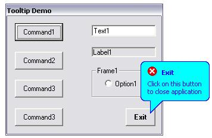



## Custom ToolTip Class \(update\)

### Description

This demo application demonstrates the use of a Custom Tooltip Class supporting square and ballon style tooltips, centered at the corresponding control or at the mouse pointer hot spot, with or without title. Individual back- and forecolors are also possible as well as an assortment of Icons to be displayed in the tooltip and finally individual delay- and show-times.

The code is easy to follow and well documented. And on top of that the class is very easy to use. Check it out, download is only 6.4 kB. (Sorry the screenshot didn't come out very well)
 
### More Info
 

             |
---                |---
**Submitted On**   |2003-01-02 21:04:40
**By**             |[ULLI](https://github.com/Planet-Source-Code/PSCIndex/blob/master/ByAuthor/ulli.md)
**Level**          |Intermediate
**User Rating**    |4.8 (205 globes from 43 users)
**Compatibility**  |VB 6\.0
**Category**       |[Miscellaneous](https://github.com/Planet-Source-Code/PSCIndex/blob/master/ByCategory/miscellaneous__1-1.md)
**World**          |[Visual Basic](https://github.com/Planet-Source-Code/PSCIndex/blob/master/ByWorld/visual-basic.md)
**Archive File**   |[Custom\_Too152629192003\.zip](https://github.com/Planet-Source-Code/ulli-custom-tooltip-class-update__1-42051/archive/master.zip)

